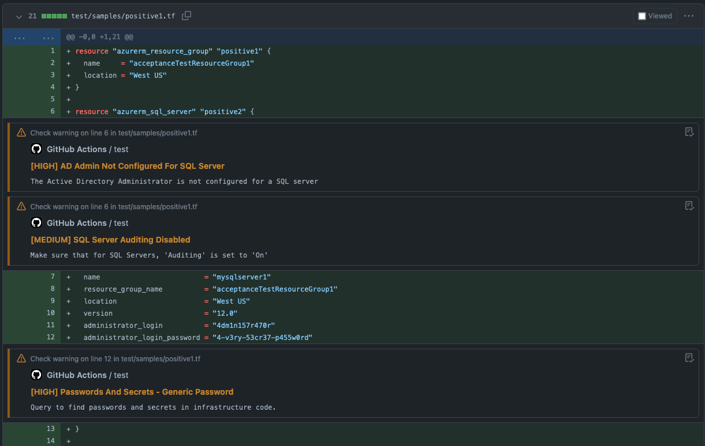

# KICS GitHub Action

[](https://www.gnu.org/licenses)
[](https://github.com/checkmarx/kics-github-action/releases)
[](https://github.com/checkmarx/kics-github-action/issues)

- [KICS Github Action](#kics-github-action)
  - [Integrate KICS into your GitHub workflows](#integrate-kics-into-your-github-workflows)
    - [Supported Platforms](#supported-platforms)
    - [Please find more info in the official website: <a href="https://kics.io">kics.io</a>](#please-find-more-info-in-the-official-website-kicsio)
  - [Inputs](#inputs)
  - [Simple usage example](#simple-usage-example)
  - [Workflow failures](#workflow-failures)
    - [Don't fail on results](#dont-fail-on-results)
    - [Fail by severity usage example](#fail-by-severity-usage-example)
  - [Enabling Pull Request Comment](#enabling-pull-request-comment)
    - [PR Comment Example](#pr-comment-example)
  - [Annotations](#annotations)
  - [Profiling KICS](#profiling-kics)
  - [Uploading SARIF report](#uploading-sarif-report)
  - [Using configuration file](#using-configuration-file)
  - [How To Contribute](#how-to-contribute)
- [License](#license)

## Integrate KICS into your GitHub workflows


**KICS** (pronounced as 'kick-s') or **Kicscan** is an open source solution for static code analysis of Infrastructure as Code.

**K**eeping **I**nfrastructure as **C**ode **S**ecure (in short **KICS**) is a must-have for any cloud native project. With KICS, finding security vulnerabilities, compliance issues, and infrastructure misconfigurations happens early in the development cycle, when fixing these is straightforward and cheap.

It is as simple as running a CLI tool, making it easy to integrate into any project CI.

#### Supported Platforms

&nbsp;&nbsp;&nbsp;
&nbsp;&nbsp;&nbsp;
&nbsp;&nbsp;&nbsp;
<br>
<br>
&nbsp;&nbsp;&nbsp;
&nbsp;&nbsp;&nbsp;
&nbsp;&nbsp;&nbsp;
<br>
<br>
&nbsp;&nbsp;&nbsp;
&nbsp;&nbsp;&nbsp;
&nbsp;&nbsp;&nbsp;
&nbsp;&nbsp;&nbsp;
<br>
<br>
&nbsp;&nbsp;&nbsp;
&nbsp;&nbsp;&nbsp;
&nbsp;&nbsp;&nbsp;
&nbsp;&nbsp;&nbsp;
<br>
<br>
&nbsp;&nbsp;&nbsp;
&nbsp;&nbsp;&nbsp;
&nbsp;&nbsp;&nbsp;
<br>
<br>
&nbsp;&nbsp;&nbsp;
&nbsp;&nbsp;&nbsp;
&nbsp;&nbsp;&nbsp;

#### Beta Features
&nbsp;&nbsp;&nbsp;
&nbsp;&nbsp;&nbsp;

In order to run the Databricks and NIFCloud queries, use the `--experimental-queries` flag when running KICS.

Official documentation page <a href="https://docs.kics.io">docs.kics.io</a>

Ensure that you're using the <a href="https://github.com/Checkmarx/kics-github-action/releases">latest KICS Github Action release</a> when creating a workflow.

## Inputs

| Variable                                  | Example Value &nbsp;                                   | Description &nbsp;                                                                                                                                          | Type    | Required | Default                                                |
|-------------------------------------------|--------------------------------------------------------|-------------------------------------------------------------------------------------------------------------------------------------------------------------|---------| -------- |--------------------------------------------------------|
| enable_comments                            | true                                                   | Enable pull request report comments                                                                                                                         | Boolean | No       | false                                                  |
| enable_jobs_summary                       | true                                                   | Enable report as jobs summary                                                                                                                               | Boolean | No       | false                                                  |
| enable_annotations                        | true                                                   | Enable annotations  report                                                                                                                                  | Boolean | No       | true                                                   |
| comments_with_queries                     | true                                                   | Add queries in th pull request report comments (available when enable_comments = true)                                                                      | Boolean | No       | false                                                  |
| excluded_column_for_comments_with_queries | description_id,similarity_id,search_line,search_value  | Excluded columns for the comment with queries, accepts a comma separated list                                                                               | String  | No       | description_id,similarity_id,search_line,search_value  |
| path                                      | terraform/main.tf,Dockerfile                           | paths to a file or directories to scan, comma separated list                                                                                                | String  | Yes      | N/A                                                    |
| ignore_on_exit                            | results                                                | defines which non-zero exit codes should be ignored (all, results, errors, none)                                                                            | String  | No       | none                                                   |
| fail_on                                   | high,medium                                            | comma separated list of which severities returns exit code !=0                                                                                              | String  | No       | high,medium,low,info                                   |
| timeout                                   | 75                                                     | number of seconds the query has to execute before being canceled                                                                                            | String  | No       | 60                                                     |
| profiling                                 | CPU                                                    | turns on profiler that prints resource consumption in the logs during the execution (CPU, MEM)                                                              | String  | No       | N/A                                                    |
| config_path                               | ./kics.config                                          | path to configuration file                                                                                                                                  | String  | No       | N/A                                                    |
| platform_type                             | terraform,ansible                                      | case insensitive list of platform types to scan                                                                                                             | String  | No       | All platforms                                          |
| exclude_paths                             | ./shouldNotScan/*,somefile.txt                         | exclude paths from scan, supports glob, comma separated list                                                                                                | String  | No       | N/A                                                    |
| exclude_queries                           | a227ec01-f97a-4084-91a4-47b350c1db54                   | exclude queries by providing the query ID, comma separated list                                                                                             | String  | No       | N/A                                                    |
| exclude_categories                        | 'Observability,Networking and Firewall'                | exclude categories by providing its name, comma separated list                                                                                              | String  | No       | N/A                                                    |
| exclude_results                           | 'd4a1fa80-d9d8-450f-87c2-e1f6669c41f8'                 | exclude results by providing the similarity ID of a result                                                                                                  | String  | No       | N/A                                                    |
| exclude_severities                        | 'info,low'                                             | exclude results by providing the severity of a result                                                                                                       | String  | No       | N/A                                                    |
| exclude_gitignore (available only from KICS version 1.6)                        |                                                        | disables the exclusion of paths specified within .gitignore file                                                                                             | Boolean  | No       | false                                                    |
| include_queries                           | a227ec01-f97a-4084-91a4-47b350c1db54                   | include only specified list of queries to the scan, cannot be provided with query exclusion flags                                                           | String  | No       | N/A                                                    |
| output_formats                            | 'json,sarif'                                           | formats in which the results report will be exported                                                                                                        | String  | No       | json                                                   |
| output_path                               | myResults/                                             | file path to store result in json format                                                                                                                    | String  | No       | "./"                                                   |
| payload_path                              | /tmp/mypayload.json                                    | file path to store source internal representation in JSON format                                                                                            | String  | No       | N/A                                                    |
| queries                                   |                                                        | path to directory with queries (default "./assets/queries")                                                                                                 | String  | No       | ./assets/queries downloaded with the binaries          |
| verbose                                   | true                                                   | verbose scan                                                                                                                                                | Boolean | No       | false                                                  |
| type                                      | Ansible,Dockerfile                                     | case insensitive comma-separated list of platform types to scan (Ansible, AzureResourceManager, CloudFormation, Dockerfile, Kubernetes, OpenAPI, Terraform) | String  | No       | all types                                              |
| bom                                       | true                                                   | include bill of materials (BoM) in results.json output                                                                                                      | Boolean | No       | false                                                  |
| disable_full_descriptions                 | false                                                  | disable request for full descriptions and use default vulnerability descriptions                                                                            | Boolean | false    |
| disable_secrets                           | false                                                  | disable secrets detection                                                                                                                                   | Boolean | false    |
| secrets_regexes_path                      | ./mydir/secrets-config.json                            | path to custom secrets regex rules configuration file                                                                                                       | String  | No       | N/A                                                    |
| libraries_path                            | ./myLibsDir                                            | path to directory with Rego libraries                                                                                                                       | String  | No       | N/A                                                    |
| cloud_provider                            | aws,azure                                            | list of cloud providers to scan (alicloud, aws, azure, gcp)                                                                                                                       | String  | No       | N/A                                                    |


## Simple usage example

```yaml
    # Steps represent a sequence of tasks that will be executed as part of the job
    steps:
    # Checks-out your repository under $GITHUB_WORKSPACE, so your job can access it
    - uses: actions/checkout@v3
    # Scan Iac with kics
    - name: run kics Scan
      uses: checkmarx/kics-github-action@v1.7.0
      with:
        # scanning two directories: ./terraform/ ./cfn-templates/ plus a single file
        path: 'terraform,cfn-templates,my-other-sub-folder/Dockerfile'
        output_path: myResults/
    # Display the results in json format
    - name: display kics results
      run: |
        cat myResults/results.json
```

## Workflow failures

By default KICS will fail your workflow on any results found.

### Don't fail on results

If you want KICS to ignore the results and return exit status code 0 unless a KICS engine error happens:

```yaml
    steps:
    - uses: actions/checkout@v3
    - name: run kics Scan
      uses: checkmarx/kics-github-action@v1.7.0
      with:
        path: 'terraform'
        ignore_on_exit: results
        output_path: myResults/
    - name: display kics results
      run: |
        cat myResults/results.json
```

### Fail by severity usage example

If want your pipeline just to fail on HIGH and MEDIUM severity results and KICS engine execution errors:

```yaml
    steps:
    - uses: actions/checkout@v3
    - name: run kics Scan
      uses: checkmarx/kics-github-action@v1.7.0
      with:
        path: 'terraform,my-other-sub-folder/Dockerfile'
        fail_on: high,medium
        output_path: myResults/
    - name: display kics results
      run: |
        cat myResults/results.json
```

## Enabling Pull Request Comment

`GITHUB_TOKEN` enables this github action to access github API and post comments in a pull request:

```yaml
name: Test KICS action PR comment

on:
  pull_request:

jobs:
  test:
    runs-on: ubuntu-latest
    steps:
    - uses: actions/checkout@v3
    - name: run kics Scan
      uses: checkmarx/kics-github-action@v1.7.0
      with:
        path: test/samples/positive1.tf,test/samples/positive2.tf
        token: ${{ secrets.GITHUB_TOKEN }}
        output_path: myResults/
        ignore_on_exit: results
        enable_comments: true
```

### PR Comment Example


**KICS version: 1.6.0**

<table>
<tr></tr>
<tr><td>

|                                                                                                                 | Category | Results |
| --------------------------------------------------------------------------------------------------------------- | -------- | ------- |
|    | HIGH     | 3       |
|  | MEDIUM   | 2       |
|     | LOW      | 0       |
|    | INFO     | 0       |
|   | TRACE    | 0       |
|   | TOTAL    | 5       |

</td><td>

|                                                                                                                      | Metric                    | Values |
| -------------------------------------------------------------------------------------------------------------------- | ------------------------- | ------ |
|  | Files scanned             | 2      |
|  | Files parsed              | 2      |
|  | Files failed to scan      | 0      |
|  | Total queries             | 821    |
|  | Queries failed to execute | 0      |
|  | Execution time            | 13s    |

</td></tr> </table>


## Annotations

After scanning, [kics-github-action](https://github.com/Checkmarx/kics-github-action) will add the results as annotations in a pull request:



## Profiling KICS

You can only enable one profiler at a time, CPU or MEM.

> 📝 &nbsp; Please note that execution time may be impacted by enabling performance profiler due to sampling

```yaml
    steps:
      - uses: actions/checkout@v3
      - name: run kics Scan
        uses: checkmarx/kics-github-action@v1.7.0
        with:
          path: 'terraform'
          profiling: MEM
          output_path: myResults/
      - name: display kics results
        run: |
          cat myResults/results.json
```

## Uploading SARIF report


```yaml
name: scan with KICS and upload SARIF

on:
  pull_request:
    branches: [master]

jobs:
  kics-job:
    runs-on: ubuntu-latest
    name: kics-action
    steps:
      - name: Checkout repo
        uses: actions/checkout@v3
      - name: Mkdir results-dir
        # make sure results dir is created
        run: mkdir -p results-dir
      - name: Run KICS Scan with SARIF result
        uses: checkmarx/kics-github-action@v1.7.0
        with:
          path: 'terraform'
          # when provided with a directory on output_path
          # it will generate the specified reports file named 'results.{extension}'
          # in this example it will generate:
          # - results-dir/results.json
          # - results-dir/results.sarif
          output_path: results-dir
          platform_type: terraform
          output_formats: 'json,sarif'
          exclude_paths: "terraform/gcp/big_data.tf,terraform/azure"
          # seek query id in it's metadata.json
          exclude_queries: 0437633b-daa6-4bbc-8526-c0d2443b946e
      - name: Show results
        run: |
          cat results-dir/results.sarif
          cat results-dir/results.json
      - name: Upload SARIF file
        uses: github/codeql-action/upload-sarif@v1
        with:
          sarif_file: results-dir/results.sarif
```

## Using configuration file

Check [configuration file](https://github.com/Checkmarx/kics/blob/master/docs/configuration-file.md) reference for more options.

```yaml
name: scan with KICS using config file

on:
  pull_request:
    branches: [master]

jobs:
  kics-job:
    runs-on: ubuntu-latest
    name: kics-action
    steps:
      - name: Checkout repo
        uses: actions/checkout@v3
      - name: Mkdir results-dir
        # make sure results dir is created
        run: mkdir -p results-dir
      - name: Create config file
        # creating a heredoc config file
        run: |
          cat <<EOF >>kics.config
          {
            "exclude-categories": "Encryption",
            "exclude-paths": "terraform/gcp/big_data.tf,terraform/gcp/gcs.tf",
            "log-file": true,
            "minimal-ui": false,
            "no-color": false,
            "no-progress": true,
            "output-path": "./results-dir",
            "payload-path": "file path to store source internal representation in JSON format",
            "preview-lines": 5,
            "report-formats": "json,sarif",
            "type": "terraform",
            "verbose": true
          }
          EOF
      - name: Run KICS Scan using config
        uses: checkmarx/kics-github-action@v1.7.0
        with:
          path: 'terraform'
          config_path: ./kics.config
      - name: Upload SARIF file
        uses: github/codeql-action/upload-sarif@v1
        with:
          sarif_file: results-dir/results.sarif
```
## How To Contribute

We welcome [issues](https://github.com/checkmarx/kics-github-action/issues) to and [pull requests](https://github.com/checkmarx/kics-github-action/pulls) against this repository!

# License

KICS Github Action

This program is free software: you can redistribute it and/or modify it under the terms of the GNU General Public License as published by the Free Software Foundation, either version 3 of the License, or (at your option) any later version.

This program is distributed in the hope that it will be useful, but WITHOUT ANY WARRANTY; without even the implied warranty of MERCHANTABILITY or FITNESS FOR A PARTICULAR PURPOSE. See the GNU General Public License for more details.

You should have received a copy of the GNU General Public License along with this program. If not, see https://www.gnu.org/licenses/.
